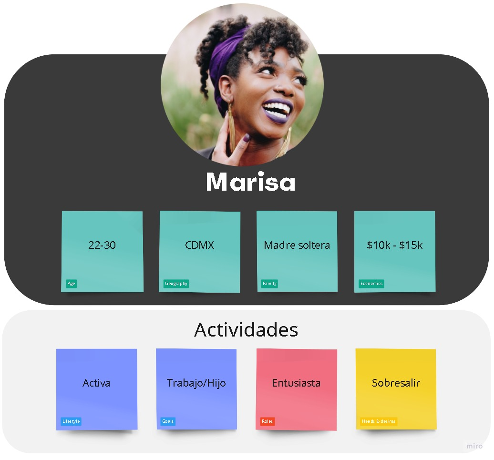
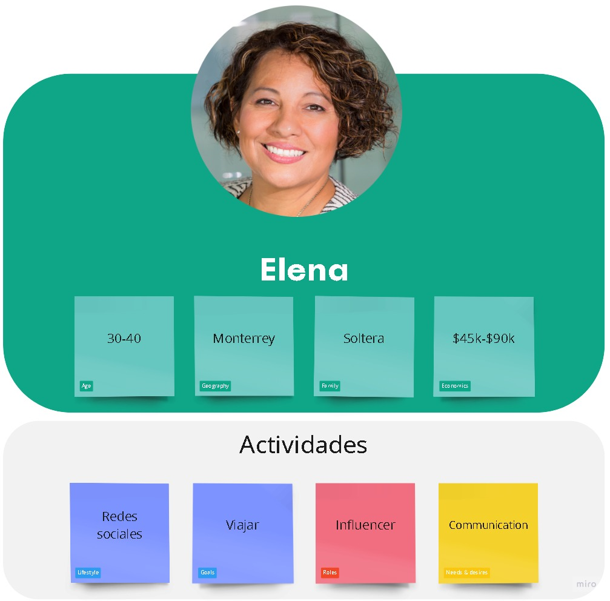

# Público objetivo
---
El público objetivo es un grupo de personas que reúne las características generales de los individuos que consumen o necesitan nuestro producto, servicio o marca.  
Para nuestro proyecto estas serían las características de nuestro público:  
  
  
  
[Volver &ldca;](/README.md "Regresar a página principal")
